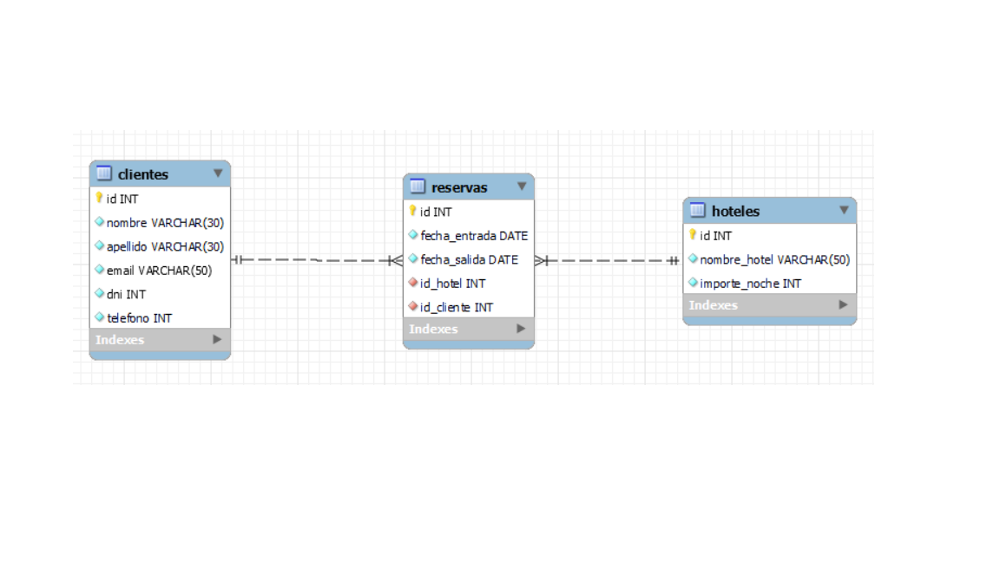

# AGENCIA DE VIAJES BDD

## CONTENIDO

- [DESCRIPCIÓN](#about)
- [DISEÑO DE BDD](#getting_started)
- [USO](#usage)
- [ENDPOINTS](#endpoints)

## DESCRIPCIÓN <a name = "about"></a>

Creación de API y BDD para gestión de reservas de una agencia de viajes, en ella podrás consultar toda la información relacionada con los clientes, las reservas y los hoteles que ofrece la agencia de viajes para alojarse.

<br>
Librerias/Frameworks: Sequelize, Express
<br>
BDD dialect: MySQL

## DISEÑO DE BDD <a name = "getting_started"></a>



### REQUISITOS

-Node.js
<br>
-Postman para realizar consultas de desarrollador

### Instalación

Instalar todas la dependencias:

```
npm install
```

## Uso <a name = "usage"></a>

Iniciar el servidor para desarrollo:

```
npm run dev
```

Url Demo para producción: https://project-agenciaviajes-production.up.railway.app/

Url Para desarrollo, por defecto en Port 3000: localhost:3000

## Endpoints <a name = "endpoints"></a>

### Clientes

| Metodo | Endpoint                     | Descripción                                                         |
| ------ | ---------------------------- | ------------------------------------------------------------------- |
| GET    | /clientes                    | Mostrara toda la información.                                       |
| GET    | /clientes/:id                | Mostrara toda la información del cliente seleccionado por ID.       |
| GET    | /clientes/nombre/:nombre     | Mostrara toda la información del cliente seleccionado por nombre.   |
| GET    | /clientes/apellido/:apellido | Mostrara toda la información del cliente seleccionado por apellido. |
| GET    | /clientes/email/:email       | Mostrara toda la información del cliente seleccionado por apellido. |
| GET    | /clientes/dni/:dni           | Mostrara toda la información del cliente seleccionado por dni.      |
| GET    | /clientes/telefono/:telefono | Mostrara toda la información del cliente seleccionado por telefono. |

### Hoteles

| Metodo | Endpoint                      | Descripción                                                     |
| ------ | ----------------------------- | --------------------------------------------------------------- |
| GET    | /hoteles                      | Mostrara toda la información.                                   |
| GET    | /hoteles/:id                  | Mostrara toda la información del hotel seleccionado por ID.     |
| GET    | /hoteles/nombre_hotel/:nombre | Mostrara toda la información del hotel seleccionado por nombre. |

### Reservas

| Metodo | Endpoint                       | Descripción                                                        |
| ------ | ------------------------------ | ------------------------------------------------------------------ |
| GET    | /reservas                      | Mostrara toda la información.                                      |
| GET    | /reservas/:id                  | Mostrara toda la información de la reserva seleccionada por ID.    |
| GET    | /reservas/fecha_entrada/:fecha | Mostrara toda la información de la reserva seleccionada por fecha. |
| GET    | /reservas/fecha_salida/:fecha  | Mostrara toda la información de la reserva seleccionada por fecha. |
